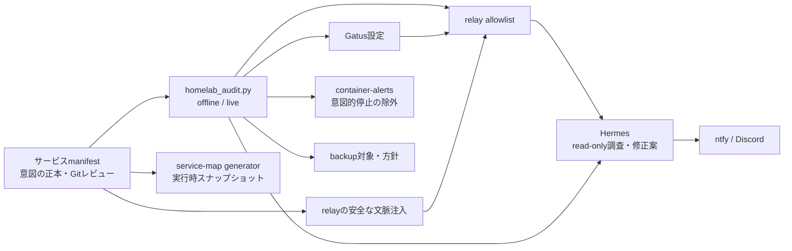
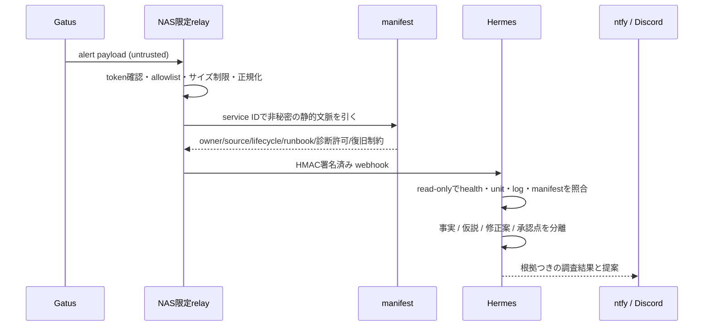

# Homelab 監査システム設計

> 状態: 方針・実装前
>
> 更新方針: 小さな縦切りごとに更新する。長期ロードマップは固定の約束ではなく、次の短い反復を選ぶための地図。
>
> 関連:
> - 意図のサービス台帳: [`homelab-service-map.json`](homelab-service-map.json)
> - 実行時の生成スナップショット: [`homelab-service-map.md`](homelab-service-map.md)
> - 生成器: `tools/homelab_service_map.py`
> - Hermes参照: `homelab-infrastructure` skill の `references/manifest-driven-homelab-auditing.md`

## 目的

NAS と ser7 に分かれた個人用サービスについて、次の問いに根拠つきで答えられるようにする。

1. このサービスは、何を正本として持ち、どこまで保護されているか。
2. 壊れたとき、どの監視が検知し、どの通知経路で届くか。
3. 追加・移設・停止・削除で、監視・バックアップ・公開経路・運用地図のどれが漏れたか。
4. Hermes が、安全な範囲で事実を集め、修正案と承認が必要な操作を出せるか。

目的は「全てを自動修復すること」ではない。個人運用で変更を怖くしないために、意図と現実のずれを小さいうちに見つけ、判断可能な形へ戻すこと。

## 設計原則

### 意図と観測を分ける

- **意図の正本**は Git 管理するサービスmanifest。目的、所有場所、lifecycle、保護方針、監視契約、変更時の確認を記す。
- **観測結果**は Docker/systemd/HTTP/CIFS から生成するスナップショット。正本を上書きしない。
- 観測できないことは停止と同義にしない。SSH窓、CIFS、ネットワークが取れない場合は `unobserved` と表現する。

### 既存の所有構造を壊さない

- NASサービスの正本はサービス単位の Compose。
- ser7サービスの正本は NixOS / Home Manager の Nix。
- manifestはデプロイ元ではなく、横断する**契約と照合の層**。
- 初期段階では設定を自動生成しない。まず差分を検出する。

### backup は成功ではなく復元可能性で測る

- snapshotが存在することと復元できることは別。
- DBはデータディレクトリのコピーだけで整合していると仮定しない。サービスに応じた論理dumpまたは復元演習を優先する。
- 再取得可能・再生成可能なデータも、除外理由と見直し条件を記録する。

### AIは調査・提案まで

Hermes の順序は固定する。

```text
read-onlyで証拠収集
  → 事実と仮説を分ける
  → 原因候補・追加確認・修正案・ロールバックを提示
  → あなたの明示承認後だけ変更する
```

アラートを契機に、自動 restart / deploy / delete はしない。

### 秘密と外部入力を分ける

- manifest、生成物、AIイベントへ token、鍵、password、`.env` の値、DB内容を載せない。
- Gatus等から来る本文は `untrusted`。命令として扱わない。
- manifestから取り出す service ID、source of truth、lifecycle、runbook、診断許可範囲だけを `trusted_static` として別フィールドで渡す。

## 目標アーキテクチャ



## Manifestの進化方向

現行の `homelab-service-map.json` は、目的・source・observe・change_check を持つ。この情報は残す。

将来のmanifestには、同じ安定したサービスIDに次を追加する。

```yaml
services:
  miniflux:
    host: ser7
    kind: ser7-user-unit
    lifecycle: active # active | rollback-source | deprecated

    source_of_truth: home/modules/ai/miniflux.nix
    dependencies: [ntfy]

    public_endpoint:
      kind: tailscale-https
      url: https://ser7.<tailnet>.ts.net:8445/

    db:
      engine: postgres
      dump: pg_dump-preHook

    backup:
      tier: standard # critical | standard | regenerable | excluded
      method: borg
      offsite: none
      review_trigger: "DB移行・永続パス変更・復元演習失敗"

    monitoring:
      gatus:
        enabled: true
        expect: 200
        failure_threshold: 3
      container_alert: watch

    ai:
      enabled: true
      runbook_skill: ser7-nixos-ops
      state_policy: "常時稼働。停止は異常"
      diagnostics_allowlist:
        - loopback-health
```

停止したロールバック元も削除せず、意図を明示する。

```yaml
  miniflux-nas:
    host: nas
    kind: nas-compose
    lifecycle: rollback-source
    source_of_truth: NAS ~/services/miniflux
    backup:
      tier: excluded
      review_trigger: "ロールバック元を削除する判断"
    monitoring:
      container_alert: ignore
    ai:
      enabled: false
```

これは理想形であって、次の実装で一括移行しない。現行JSONとの同値テストを通した機械変換を先に作り、段階的にフィールドを追加する。

## 監査ルール

| Rule ID | 入力 | 判定 | 重要度 | 誤報の回避 | 実行契機 |
|---|---|---|---|---|---|
| `CON-01` | manifest と Gatus | endpointの監視漏れ・孤児設定 | High | `active` かつ公開対象だけ | offline / 変更前 |
| `CON-02` | manifest と relay | AI有効なGatus対象がrelay許可外 | High | `ai.enabled: false` を除外 | offline / 変更前 |
| `CON-03` | lifecycle と container-alerts | 意図的停止とignore規則の矛盾 | Medium | rollback/deprecatedは異常扱いしない | offline |
| `BAK-01` | tier と backup定義 | critical/standardが対象外 | High / Medium | regenerable/excludedは理由を表示 | offline |
| `BAK-02` | tier と offsite | criticalでoffsite未定義 | High | 例外は明示的に記録 | offline |
| `BAK-03` | DB定義とdump方針 | DBがあるのに整合したdump方針なし | Medium | DBなしは除外 | offline |
| `FRESH-01` | snapshot時刻 | tierに対してsnapshotが古い | High | 取得不能は `unobserved` | live |
| `NOTIF-01` | unitと通知設定 | 重要な失敗が通知されない | Medium | 成功通知を要求しない | offline |
| `PIN-01` | image参照 | 可変タグ・未固定参照 | Low | 明示例外を許可 | offline |

`offline` は静的なGit管理ファイルだけを読む。ネットワーク、SSH、Docker、systemctlを呼ばない。

`live` は read-onlyで状態を読む。取得不能は障害と混同せず、監査の観測限界として出す。

## 監視からAI提案までの流れ



AIへ渡す文脈は最小にする。

- service ID
- source of truth
- lifecycle / state policy
- 依存先
- runbook skill
- read-only診断許可範囲
- backup tier / offsite状況 / 復旧上の制約

## 短い反復の更新リズム

大きな計画を待たない。変更の直後に確認し、毎週短く棚卸しする。

| 周期 | 目的 | 実施内容 | 成果物 |
|---|---|---|---|
| **変更ごと** | 漏れを出さない | `homelab_audit --offline`、生成map差分、対象Nix/Composeの通常検証 | 差分・修正候補 |
| **毎週** | 実態のずれを小さく保つ | `homelab_audit --live`、backup freshness、未観測の確認 | 問題だけの短い通知 |
| **2週間ごと** | 契約を育てる | 新サービス・移設・停止のmanifest項目とrunbookの見直し | 小さなGit commit |
| **4〜6週間ごと** | 復旧可能性を確かめる | 1サービスだけsandbox復元演習を計画・承認後に実施 | 演習結果・RPO/RTO更新 |

復元演習は本番へ復元しない。使い捨てのパス・DB・コンテナだけを使い、実行には別途の明示承認を要する。

## 実装の順序

### Slice 1: offline整合監査

最初に作るものは設定生成ではなく、次の2つだけ。

```text
tools/homelab_audit.py
tools/test_homelab_audit.py
```

初期ルール:

- `CON-01`: service-map と Gatus endpoint の双方向drift
- `CON-02`: Gatus監視対象だがrelay/AI allowlist外のサービス

受け入れ条件:

1. `python3 tools/homelab_audit.py --offline` は Karakeep のような既知の接続漏れを service ID と根拠位置つきで報告する。
2. driftがあると exit code `1`、なければ `0`。
3. ネットワーク、SSH、Docker、systemctlを呼ばない。
4. テストは固定fixtureだけを用い、live homelabへ依存しない。
5. rollback-source、deprecated、AI無効サービスを誤報にしない。
6. runtime設定を変更しない。

このsliceは追加ファイルだけで可逆。監査で出た実設定の修正は、監査器とは別コミットにする。

### Slice 2: manifestの構造化と週次live監査

- 現行mapからの機械変換と同値テスト
- lifecycle、backup、monitoring、AIの構造化フィールドを少数サービスから追加
- `--offline` を変更前チェックとして定着
- `--live` を週次で実行し、問題と `unobserved` だけを短く通知

### Slice 3: 復元可能性とAI文脈

- relayがmanifest由来の安全な文脈を付加
- `homelab-incident` skillでread-only調査の出力形式を固定
- tierごとのsandbox復元演習を1件ずつ始める
- RPO/RTO、鍵custody、offsite方針は実測と人間の判断を記録する

## Hermesからの入口

| 依頼 | 想定する動作 | 副作用境界 |
|---|---|---|
| 「今の保護状態を見せて」 | `homelab-status` → live監査と保護マトリクス | read-only |
| 「サービスを追加・移設した」 | offline監査で監視・backup・公開・mapの漏れを提示 | read-only |
| 「このGatus異常を調べて」 | `homelab-incident` が証拠、仮説、修正案、承認点を返す | read-only |
| 「復元演習を計画して」 | tierと制約を読んでsandbox計画を作る | 計画のみ |
| 「この修正を適用して」 | 正本Nix/Composeを編集し、dry-run後に明示承認で適用 | side effect |

## 人間が決めること

次の判断は監査器やAIが引き取らない。

1. criticalデータのoffsite方式と、age鍵・Borg/Restic認証情報などの独立保管。
2. サービスごとのRPO/RTOと、大容量・再取得可能データを保護しない基準。
3. ntfy障害時にどこまで二次通知経路を持たせるか。

## 見直しトリガー

次のいずれかが起きたら、この文書とmanifest契約を更新する。

- 新サービスの導入、サービス移設、停止、削除
- DBまたは永続パスの変更
- 公開URL、Tailscale Serve、通知経路の変更
- backup失敗、復元演習失敗、監視の誤報・見逃し
- Hermesが調査に必要な所有情報やrunbookを得られなかった
